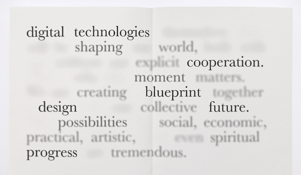
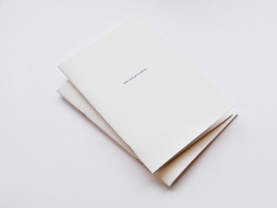
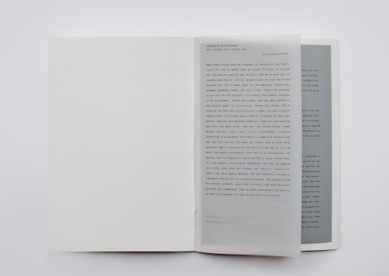
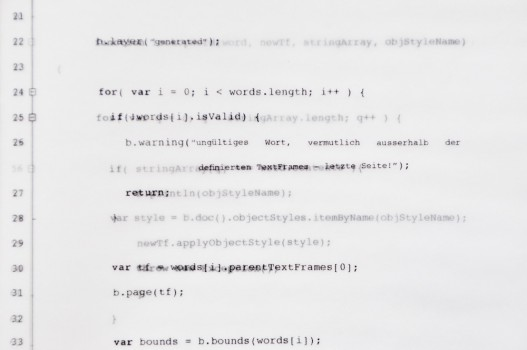
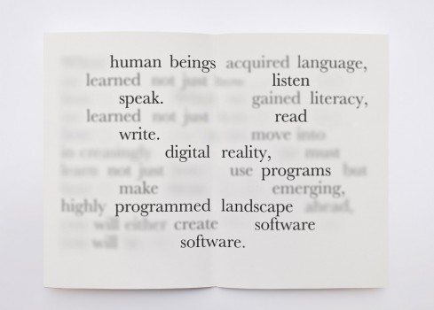

---
authors:
  - name: Felicitas Katharina Merz
    url: http://www.felicitas-merz.de
  - name: Inken Zierenberg
    url: null

layout: gallery-item
title: "Affected  Perception"
description: The automated design works with the typographical layout content. Out of the manual word categorization eight arrays are sorted after the word importance. The automated scripting changes the words in the single arrays after the defined objectstyles. Through this the most important word groups stay readable and the less important word groups get less readable.
---

The developed theme „Affected perception“, refers to an abridgment of the text „Program or be programmed“ by Douglas Rushkoff. The goal was to create an appereance based on the manipulated perception of the typographical layout content. The project should represent an example of the field of abstraction, modification, readability and alienation. The improvement of the workflow consists of the steps: Manually creation by hand , generating and modifying by code and re-editing for print publishing by hand. The concept is based on eight classified word groups (arrays). Every word is sorted after its importance in the text. The goal is to automate the determinations of a single word group by a certain defined object style. The object styles hel- ped to define the difference of the visual appearance. Through the defined object styles the color changed into transparent and a cast shadow is added. The cast shadow gets bigger with the unimportance and the opacity is reduced with the unimportance of the words. The soft edges and the additional drop shadows help to create a liquid shade of words hierarchical sorted after importance. As result of the code the most important word group stays readable and the less important words get unreadable.

### Source


#includepath "~/Documents/;%USERPROFILE%Documents"; 
#include "basiljs/bundle/basil.js";

function draw() {
   
    var impWords1 = ["human", "beings", "listen", "speak", "read", "write", "digital", "reality", "programs", "programmed", "landscape", "software", "Program", "access", "control", "panel", "digital", "technologies", "Computers", "networks", "living", "things", "technology",  "future", "programming", "cooperation", "blueprint", "design", "progress", "knowledge", "civilization"]; 
    var impWords2 = ["language", "literacy ", "choice", "tools", "instructions", "characterize", "shaping", "possibilities", "ability"];
    var impWords3 = ["acquired", "learned", "gained", "use", "increasingly", "make", "emerging", "create", "Choose", "ways", "natural", "means", "way", "live", "work", "world", "creating", "collective", "social", "economic", "practical", "artistic", "spiritual", "tremendous", "gave", "shared", "inconceivably", "conceivable", "entirely", "engaged","connected", "responding", "unpredictably", "opposed", "interactive", "incapable", "learn", "works", "give"];
    var impWords4 = ["move", "highly", "simple", "former", "latter", "real", "get", "many", "growth", "went", "markedly", "different", "more", "mere", "comes", "come", "take", "increasingly", "important", "explicit", "matters", "together"];
    var impWords5 = ["not", " just", "into", "must", "but", "ahead,", "will", "really", "gain", "could", "last", "make", "while", "out", "before", "like", "Unlike", "even", "also", "as", " such", "After", "pass", "now"];
    var impWords6 = ["rake", "pen", "jackhammer", "words", "people", "call", "role"];
    var impWords7 = ["When", "we", "how", "them", "you", "be", "it", "are", "what", "They", "themselves", "with", "itself", "our", "will", "both", "without", "why", "We", "they"];
    var impWords8 = ["to", "And", "In", "an", "or", "It´s", "the", "and", "For", "than", "a", "This", "is", "it", "its", "of", "on", "it's", "itself.", "in", "That's", "that,", "them.", "themselves", "that", "That´s", "this", "The", "for", "to",  "so"];

    var story = b.doc().stories[0]; // first story in document

    var words = b.words( story );

    b.layer("generated");

    for( var i = 0; i < words.length; i++ ) {

        if(!words[i].isValid) {
            b.warning("ungültiges Wort, vermutlich ausserhalb der TextFrames!");
            return;
        }

        var tf = words[i].parentTextFrames[0];
        b.page(tf);
        
        var bounds = b.bounds(words[i]); 
        var newTf = b.text(words[i].contents, bounds.left, bounds.top, bounds.width + 3, bounds.height);

        try{
            lookUpWord(words[i], newTf, impWords1, "imp1");
            lookUpWord(words[i], newTf, impWords2, "imp2");
            lookUpWord(words[i], newTf, impWords3, "imp3");
            lookUpWord(words[i], newTf, impWords4, "imp4");
            lookUpWord(words[i], newTf, impWords5, "imp5");
            lookUpWord(words[i], newTf, impWords6, "imp6");
            lookUpWord(words[i], newTf, impWords7, "imp7");
            lookUpWord(words[i], newTf, impWords8, "imp8");
        } catch(exception) {
            continue; // gehe zum nächsten wort
        }

}

function lookUpWord(word, newTf, stringArray, objStyleName){

    for( var q = 0; q < stringArray.length; q++ ) {

        if(  stringArray[q] === word.contents ){ 
            b.println(objStyleName); 
            var style = b.doc().objectStyles.itemByName(objStyleName);
            newTf.applyObjectStyle(style); 
            throw new Exception();
            } 
        }

    }
        
}

b.go(); 

