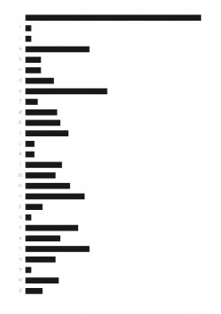
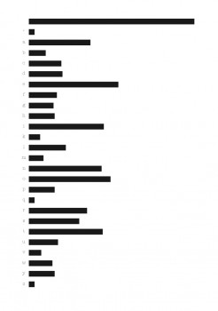
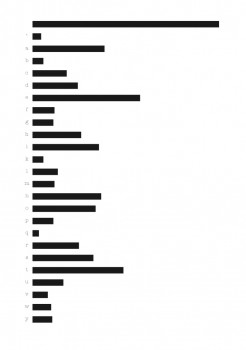

---
authors:
  - name: Jessica Campbell
    url: null
  - name: Riem Ibrahim
    url: null

layout: gallery-item
title: "Alphabet  Bars"
description: Our designs visualize the text, Program or Be Programmed by Douglas Rushkoff, alphabetically with rectangles of varying length. The length of each rectangle or bar is determined by the amount of times a letter or character appears on the page. Our goal was to use JavaScript to deconstruct the meaning of text completely, and reorganize and restructure the way it is read.

---

We used the alphabet as an organizing principle of this deconstruction to conserve some level of readability. There are two codes. One draws horizontal alphabet bars, the other draws vertical alphabet bars.

The images on this page represent three pages of Douglas Rushkoff’s book.

### Source

  
[Download Source](./downloads/alphabet_bars.zip)


    #includepath "~/Documents/;%USERPROFILE%Documents";
#include "basiljs/bundle/basil.js";

function draw() {

   b.canvasMode(b.MARGIN);

   var hash = new HashList();
   var preString = b.selections()[0];
   var longString = preString.contents;

  var tf1 = b.text( longString, 0,0,b.width,200 );
   var words = b.characters(tf1);

   var str;
   for( var i = 0; i < words.length; i++){
       str = words[i].contents;
       switch(str.toString()){
           case "SINGLE_RIGHT_QUOTE":
            str="'";
           break;
           case "EM_DASH":
            str="-";
           break;
           case "DOUBLE_LEFT_QUOTE":
            str='"';
           break;
            case "DOUBLE_RIGHT_QUOTE":
            str='"';
           break;
           }

       str = b.trimWord(str);
       str = str.toLowerCase();
       if(hash.hasKey(str) ){
           hash.set(str, hash.get(str) + 1);
       } else {
           hash.set( str, 1 );
       }
   }

  tf1.remove();
  preString.remove();
   var keys = hash.getSortedKeys();
   var valueKeys = hash.getKeysByValues();

   for(var i = 0; i < hash.length; i++) {
       b.println(hash.get( keys[i] ));

       b.text(keys[i], 0, b.height/hash.length*i, 20, b.width/30);

       b.textAlign(Justification.CENTER_ALIGN);
       b.textFont("American Typewriter","Light");
       b.textSize(9);

       var bars = b.map(hash.get( keys[i] ),1,hash.get( valueKeys[0] ), 10, b.width-30);

       b.rect(20, b.height/hash.length*i, bars, b.width/35);
}

}

b.go();
