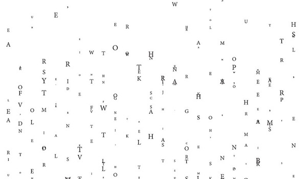
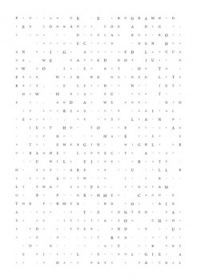
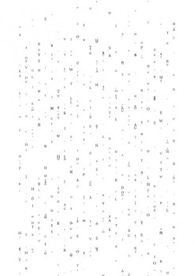
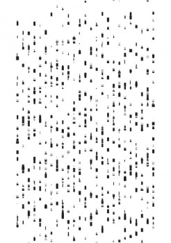

---
authors:
  - name: Kate Marie Koyama
    url: null
  - name: Kyulee Kim
    url: null
  - name: Fatima Montiel
    url: null

layout: gallery-item
title: "Breaking the Grid"
description: Our goal was to relate our experiments to the given text (Program or Be Programmed by Douglas Rushkoff), for example, when you take a program as it is you find yourself in a grid with certain limitations; however when you learn to control the program you allow yourself to stray from the grid, break free from it.
---

After analyzing the text “Program or Be Programmed”—by Douglas Rushkoff—we developed a series of experiments using a grid as our basis. With the use of Javascript, we divided the area within the margins of the page into 750 equally sized and distributed rectangles. Then, we highlighted a portion of the text and placed the individual letters in the boxes. Each time the characters exceeded the number of boxes in the page, a new rule would apply. The rules varied from position on the page, size, baseline and addition of elements such as bars.

### Source


    #includepath "~/Documents/;%USERPROFILE%Documents";
#include "basiljs/bundle/basil.js";

var myBoxes = new Array();
var myCounter = 0;

function draw() {
  b.canvasMode(b.MARGIN);
  b.noStroke();
  buildBoxes();
   
  var selItems = b.selections();    
  b.characters(selItems[0], function(ch, n){
    if(n > myCounter){
        b.addPage(b.AFTER);
        buildBoxes();
    }
    if(n > 750 && n<1500){
      b.typo(tf, "baselineShift", b.random(50,-100));
    }
    if(n > 1500){
      b.typo(tf, "pointSize", 7);
      b.typo(tf, "underline", true);
      b.typo(tf, "underlineWeight", b.random(.25, 10));
    }
      tf = myBoxes[n];
      b.typo(tf, "contents", ch.contents);
      b.typo(tf, "capitalization", Capitalization.ALL_CAPS );
      b.typo(tf, "pointSize", b.random(2,9));
  });
}
  
function buildBoxes(){ 
  for (var j = 0; j < b.height-1; j+=b.height/30){
   for (var i= 0; i < b.width-1; i+=b.width/25){
   b.textAlign(Justification.CENTER_ALIGN, VerticalJustification.CENTER_ALIGN);
   b.stroke("preto");
   b.strokeWeight(.25);
   myBoxes[myCounter] = b.text(" ",i, j ,b.width/25, b.height/30); 
    myCounter++;
    }
  }
}

b.go();
