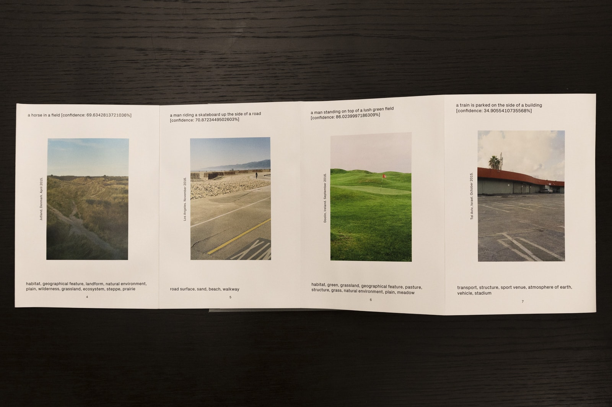
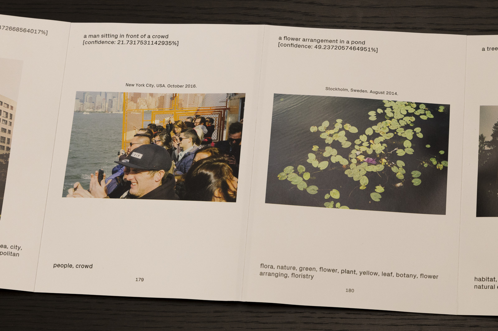
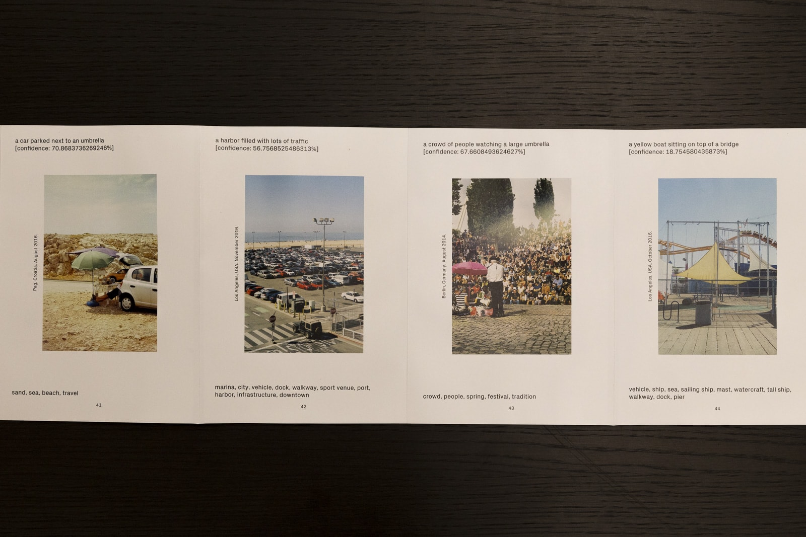
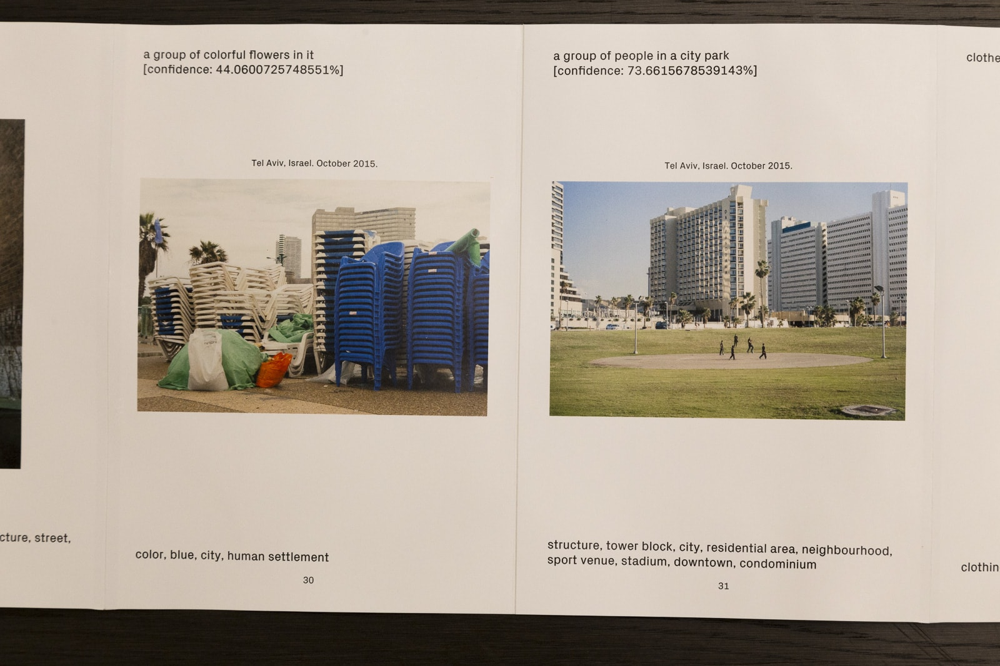
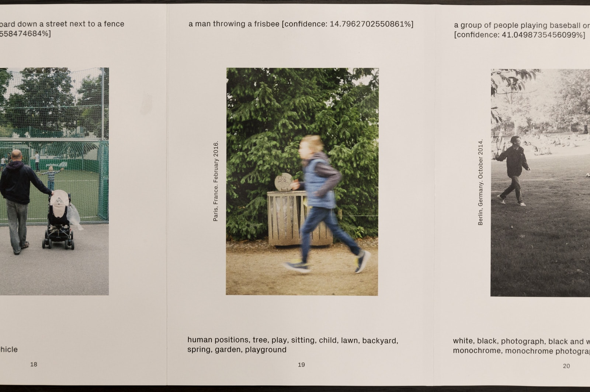
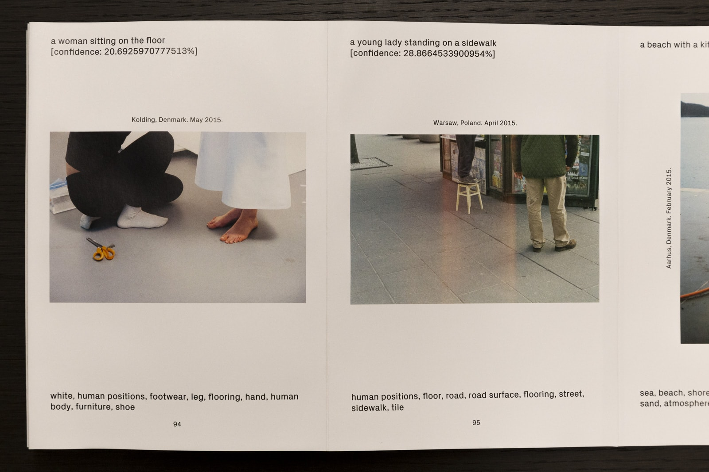

---
authors:
  - name: Philipp Schmitt
    url: https://philippschmitt.com
layout: gallery-item
publish: true
title: Computed Curation
description: Curating photography with neural networks.
featured: true
---

Computed Curation is a computer-generated accordeon photobook

Computed Curation is a photobook created by a computer. Taking the human editor out of the loop, it uses machine learning and computer vision tools to curate a series of photos from an archive of pictures.

Considering both image content and composition — but through the sober eyes of neural networks, vectors and pixels — the algorithms uncover unexpected connections and interpretations that a human editor might have missed.

To browse the book [open the web version here](https://philippschmitt.com/computed-curation-web/) or [download the PDF](https://philippschmitt.com/downloads/Computed-Curation-Book.pdf).

Machine learning based image recognition tools are already adept at recognizing training images (umbrella, dog on a beach, car), but quickly expose their flaws and biases when challenged with more complex input. In Computed Curation, these flaws surface in often bizarre and sometimes poetic captions, tags and connections. Moreover, by urging the viewer to constantly speculate on the logic behind its arrangement, the book teaches how to see the world through the eyes of an algorithm.

You can buy the book at [Bromide Publishing House Ltd.](https://bromidestore.fws.store/Computed_Curation,_Philipp_Schmitt/p6022973_19351829.aspx)

Use the slideshow to flick through some of the pages.

### Process

The book features 207 photos taken between 2013 to 2017. Metadata is collected through Google's [Cloud Vision API](https://cloud.google.com/vision) (tags, colors), Microsoft's [Cognitive Services API](https://www.microsoft.com/cognitive-services/en-us/computer-vision-api) (captions) and Adobe Lightroom (date, location). Composition is analyzed using HOGs[^1].

Considering more than 850 variables for each photo, a t-SNE[^2] algorithm arranges the pictures in two-dimensional space according to similiarities in content, color and composition. A genetic TSP algorithm[^3] computes a shortest path through the arrangement, thereby defining the page order.

<iframe src="https://player.vimeo.com/video/225081193?byline=0&portrait=0" width="100%" frameborder="0" allow="autoplay; fullscreen" allowfullscreen></iframe>

The book layout is generated using a custom Node.js application and rendered in InDesign using [basil.js](http://basiljs.ch). The book is printed on a HP Indigo digital press and hand-bound as an accordion book with a total length of 29 meters (95ft).

Computed Curation is a computer-generated accordeon book with a total length of 29 meters (95ft).

### Footnotes

[^1]: Histogram of oriented gradients; an algorithm used in computer vision for object detection. For future iterations I plan to look into convolutional neural networks.
[^2]: t-distributed stochastic neighbor embedding; a popular algorithm to reduce data with thousands or millions of dimensions (i.e. attributes) to two or three dimensions percievable by humans. [A visual explanation](https://www.oreilly.com/learning/an-illustrated-introduction-to-the-t-sne-algorithm).
[^3]: The travelling salesman problem (TSP) is a classic computer science problem: Given a list of cities, what is the shortest possible route that visits each city exactly once? (I simplified!)

### Credits

**Concept & Development:** Philipp Schmitt  
**Photography:** Philipp Schmitt  
**Book Design:** Philipp Schmitt & [Margot Fabre](http://margot-fab.com)  
**Typography:** [Px Grotesk](http://www.optimo.ch/typefaces_Px-Grotesk.html) by Optimo Type  
**Printing:** [CedarGraphics](https://www.cedargraphicsinc.com)  
**Special Thanks:** [Mathias Bernhard](http://www.mathiasbernhard.ch/), [Daniel Schwarz](http://danielschwarz.cc), [Moe Vazifeh](http://www.mvazifeh.com), Sebastiano Milardo, [Ian Seiferling](http://www.ianseiferling.com)  
**Open Source:** [node.js](https://nodejs.org/en/), [mongoDB](https://www.mongodb.com), [hog-descriptor](https://github.com/harthur/hog-descriptor), [word2vec](http://word2vec.googlecode.com), [GA-TSP](https://github.com/parano/GeneticAlgorithm-TSP), [tsne-js](https://github.com/scienceai/tsne-js), [basil.js](http://basiljs.ch)

