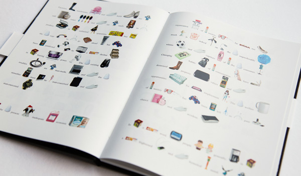

---
authors:
  - name: Bettina Schneebeli
    url: null
layout: gallery-item
title: Ending  the  Depression  through  Amazon
description: A text – image correlation between an article by Bernhard London from 1932 and according product pictures from amazon.com.
---

<iframe src="http://player.vimeo.com/video/57749978?portrait=0" width="600" height="337" frameborder="0" webkitallowfullscreen="" mozallowfullscreen="" allowfullscreen=""></iframe>

This book results from delving into the topics of data and consumption and from the exploration of basil.js. The text of Bernhard London from the year 1932 proposes the solution of the economic crisis at that time through the introduction of a law that would force the citizens to hand in their products for destruction after a certain amount of time. The visual correlation of the text’s words with product images from Amazon results in a dialogue between the essay from the thirties with an economic system typical for today – the online shop. The flood of goods that is proposed by the author is therefore visible as a flood of product images and the imagined system is set into a relationship with today’s intensity of consumption and the currently often short lifetime of products. Through the way of the images being defined by the text, they form a seemingly random accumulation of goods. Those hereby suffer from a loss in value. This is depicting a change of attitude towards products, that would be a precondition for the system demanded by London.

