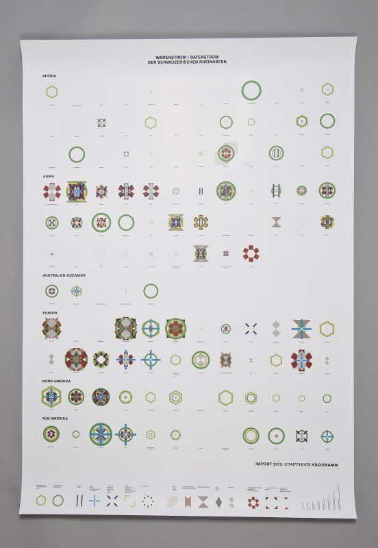

---
authors:
  - name: Simon Ziffermeyer
    url: http://simon-ziffermayer.ch/
layout: gallery-item
title: Flow of Goods / Data Stream
description: Twelve per cent of all imported goods in Switzerland are coming through the seaport of Basel. The piece «flow of goods / data stream» gives an overview over all goods and streams in the year of 2012.
---

[Simon Ziffermeyer](http://simon-ziffermayer.ch)

Twelve per cent of all imported goods in Switzerland are coming through the seaport of Basel. The piece «flow of goods / data stream» gives an overview over all goods and streams in the year of 2012.

[http://simon-ziffermayer.ch/bachelor-thesis-3/](http://simon-ziffermayer.ch/bachelor-thesis-3/)

Many resources that we use are coming through the ports of Basel. Therefore year per year resources with a total weight of about seven million tons passed the Swiss Rheinports. Especially for the import this harbor takes an essential role. Between ten and 12 per cent of all imported goods reach Switzerland by water.

For the starting position I have used a document in which all involved countries were listed. Each product and its weight is listed and ordered according to its country of origin. The goal of the project is to give an overview of the whole import and export situation in contrast to complex data sets. The visualization allows the viewers to see the intensity and quantity at a glance. This way of representation also allows for a comparative analysis of the origins of the continents where the goods come from or where the final destinations are.

By applying a script the data is made representable as forms. The size of the forms visualizes the weight. Each shape is representing a product such as green shapes for organic products as example.

