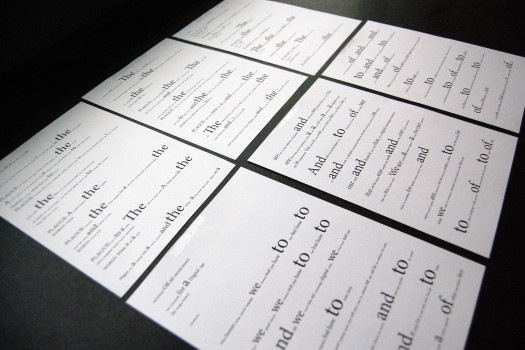
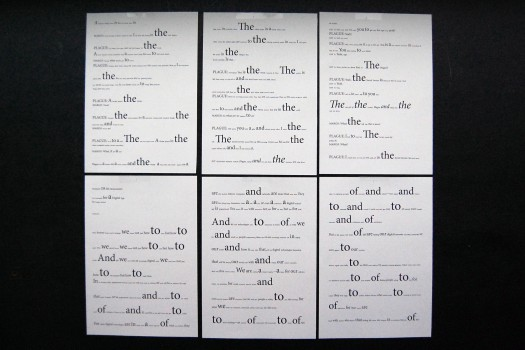
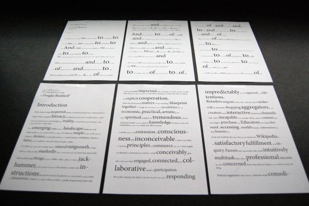

---
authors:
  - name: Nicole Lesniak
    url: null
layout: gallery-item
publish: true
title: "Frequency mapping"
description: The goal of this code was to enlarge the most used words and then the least used words in a document. The code was applied to three different kinds of texts – a persuasive essay, a science fiction movie script, and an instructional guide.

---

The hypothesis was that when the most-used words are enlarged, the three texts will appear the same but when the least-used words are enlarged clues to the texts meaning will be revealed. Unexpectedly, the most interesting result of this experiment is that when the most-used words were enlarged (typically prepositions and conjunctions) each text was different. This could reveal that even small words like “the,” “to,” and “you,” can explain the nature of a text. The enlargement of the least-used words was not as interesting because so many words are only used once in a text. Objective alterations were made to the code to give preference to longer words being used only a few times. More texts would have to be tested to truly reveal any patterns or consistencies.

### Source

  
[Download Source](./downloads/frequency_mapping.zip)

    #includepath "~/Documents/;%USERPROFILE%Documents";
#include "basiljs/bundle/basil.js";

function draw() {
    
  var hash = new HashList();
  var tf = b.selections()[0]; // this makes the selected item now being referred to as var tf. the [0] is because the "selection" always returns an array, and this referes to the first object in an array.
  
  
  var words = b.words(tf.parentStory); // this is identifying the words from tf's whole story. tf.parentStory is acting like us highlighting the whole text.
  var str;
  for( var i = 0; i < words.length; i++){ //for all the words in the words array, add them to str, and then trim them of . , " etc
    str = normalizeString(words[i].contents);

    if (str == "") continue; // special case: nothing left after trimWord
     //count the number of occurances
    if( hash.hasKey(str) ){ // identifies a word from the array
      //  b.println(str); // adds it to the console (seen in this program)
        hash.set(str, hash.get(str) + 1); //adds 1 to the count for this word
    } else {
        hash.set( str, 1 ); // if the word didn't appear before, add it to the set with count 1
    }
  }
  
  var keys = hash.getKeysByValues() ; // sorts it by the number of its occurences
  
  for( var i = 0; i < words.length; i++ ) { // for all the words in the words array
      
    var word = words[i]; // word = the word currently being looked at
   
    var frequency = hash.get( normalizeString (word.contents) ); // get the number of times the word occurs, the string is in contents, all dots and commas, etc have to be removed with trimWord as done while counting
    frequency = b.constrain(frequency, 0, 150); // constrain this number to be between 0-150
    frequency = b.map(frequency, 0, 150, 5, 50); // change the font to be between 3 - 72 porportionately. 
      
    b.typo( word, "pointSize", frequency ); // change the font size of the word[i] to be the size of frequency
  }

}

function normalizeString(myString) {
    
        myString= b.trimWord(myString);
        myString= myString.toLowerCase(); 
        return myString;
     
}

b.go();
