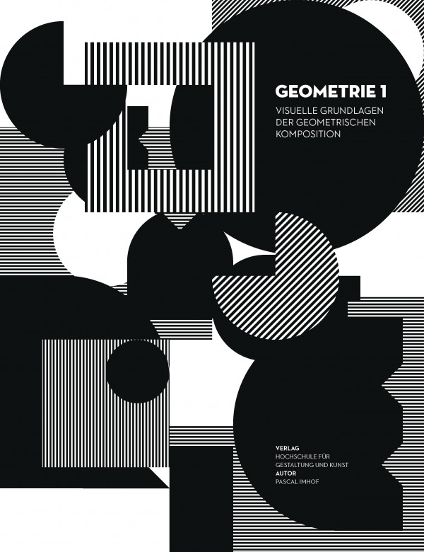
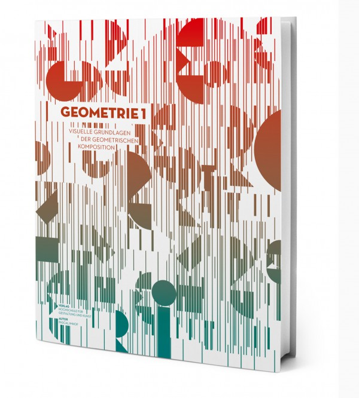
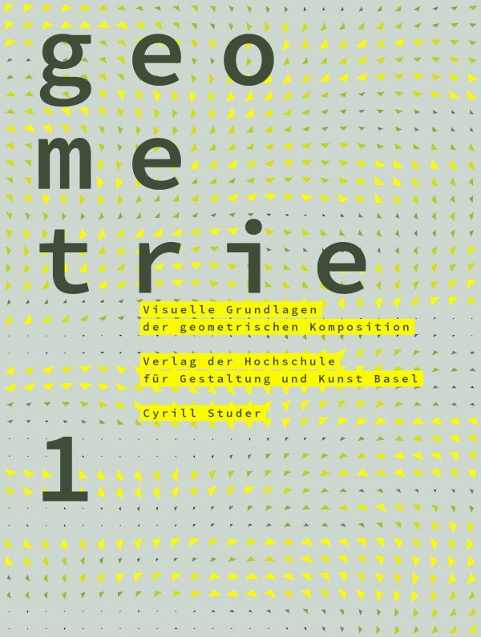
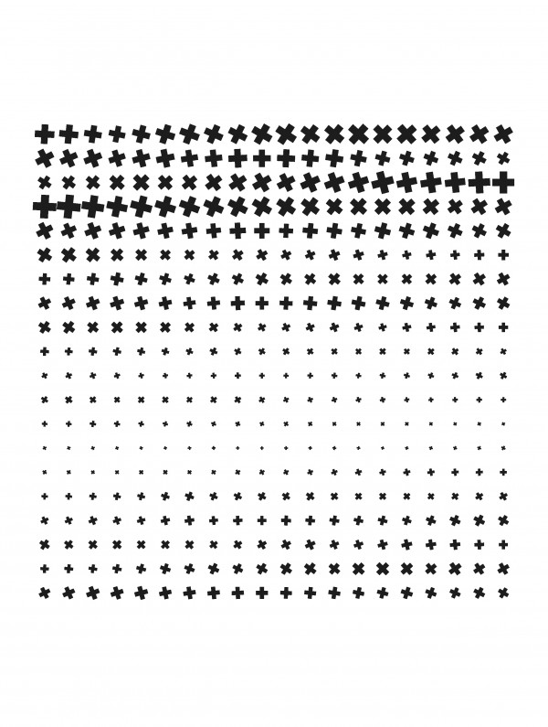
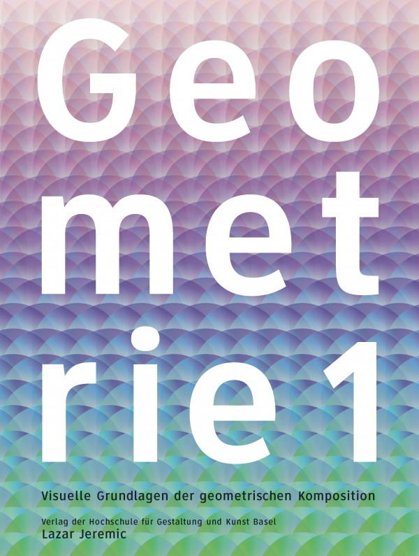
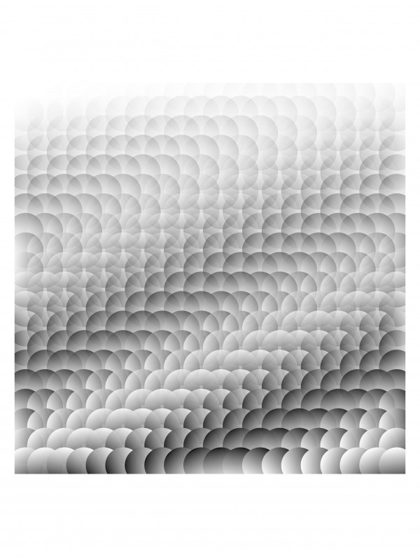
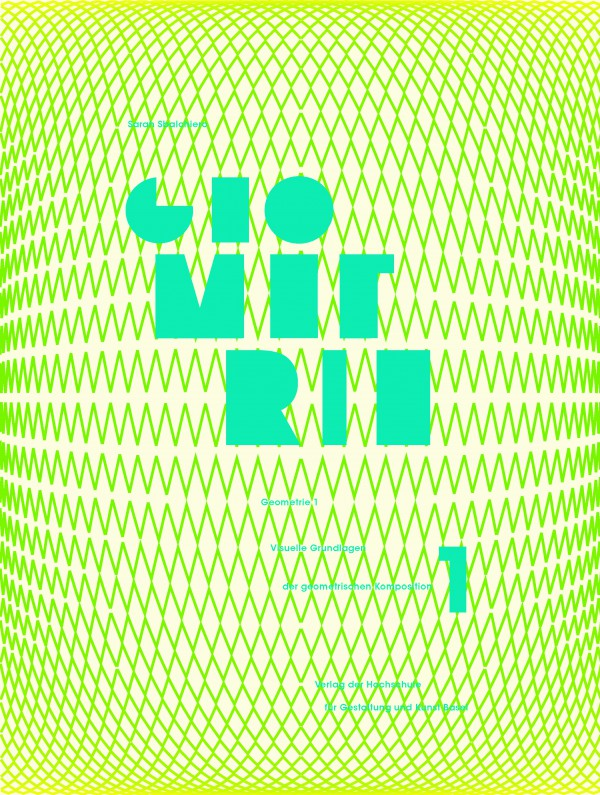
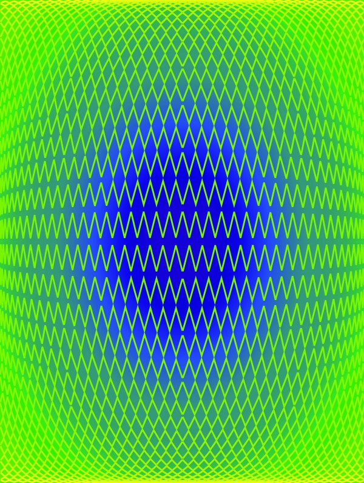

---
authors:
  - name: Pascal Imhof
    url: null
  - name: Cyrill Studer
    url: null
  - name: Lazar Jeremic
    url: null
  - name: Sarah Sbalchiero
    url: null
layout: gallery-item
title: Geometrie 1
description: Results of the foundational introduction course into Generative Design with basil.js at the Visual Communication Institute in Basel by Martin Fuchs and Ludwig Zeller.
---

Pascal Imhof

The brief of this first year seminar at the Visual Communication Institute in Basel is to design a cover for a fictional book about Generative Design entitled “Geometrie 1”. Students learned how to generate ornamental and formal visuals that represent some of the core principles such as repetition, chaos and the fluid transition between mouse and code-based design with basil.js and Adobe InDesign.

Pascal Imhof

Cyrill Studer

Cyrill Studer

Lazar Jeremic

Lazar Jeremic

Sarah Sbalchiero

Sarah Sbalchiero