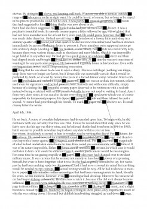
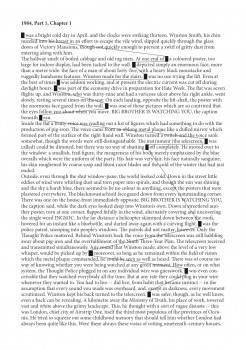
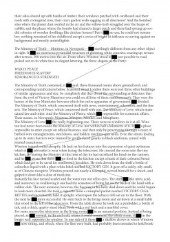
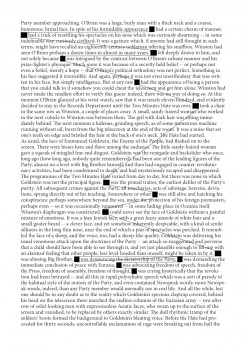
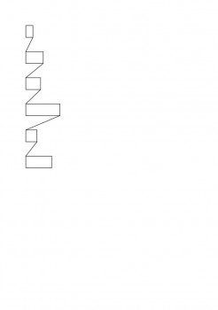

---
authors:
  - name: Timothy Hall
    url: null
  - name: Ondrej Jelinek
    url: null

layout: gallery-item
publish: true
title: "-linking-words-"
description: The act of reading is simple and sometimes boring. You start at the top left corner and finish at the bottom right corner. The goal of this project is to change the act of reading. In doing so we keep the reader focused and aware of what he is doing.
---

We want to lead the reader through the text; we tell him how to read the text. We as designers become the author of a text which we didn't write.

We have two different approaches:

A) the text gets split up; the words are arranged on the new page; connecting lines are made between the words. These new pages are still readable, but with a twist: we change the reading direction. Also the text page has a new and interesting visual appearance.

B) the text stays the same; some words get censored by a black box; the boxes are connected to show that per page the same word is censored; all the censored words give a sentence at the end (a little like a crossword puzzle); the last page has the boxes on it where the reader can fill in the censored words. This approach should make reading fun and challenging. We tried to make a game out of reading a text.

### Source

  
[Download Source](./downloads/linking-words-.zip)


#includepath "~/Documents/;%USERPROFILE%Documents";
#include "basiljs/bundle/basil.js";

function draw() {
  var layer = b.layer("imagelayer");
  var fillBoundsOld;
  riddle(1, "It");
  riddle(2, "Was");
  riddle(3, "The");
  riddle(4, "Writing");
  riddle(5, "He");
  riddle(6, "Hated");

  function riddle(pageNum, cWord) {
    var selItems = b.items(b.page(pageNum));
    var boundsOld;
    var censoredWord = cWord;
    var mySel = selItems[0];
    b.words(mySel, function (bs, n) { // for each word of item
      if (b.trimWord(bs.contents) == censoredWord.toLowerCase() || b.trimWord(bs.contents) == censoredWord) {
        var bounds = b.bounds(bs);
        if (boundsOld == undefined) {
          boundsOld = bounds;
        }
        b.strokeWeight(0.5);
        b.line(boundsOld.right, boundsOld.bottom, bounds.left, bounds.top);
        b.rect(bounds.left, bounds.top, bounds.width, bounds.height);
        b.page(pageNum);
        boundsOld = bounds;
      }
    });
    b.page(7);
    var myScale = 2.5;
    b.noFill();
    b.strokeWeight(1);
    var fillRect = b.rect(50, 50 * pageNum, boundsOld.width * myScale, boundsOld.height * myScale);
    var fillBounds = b.bounds(fillRect);
    //  for (var i = 0; i < 5; i++){
    if (fillBoundsOld == undefined) {
      // fillBoundsOld = fillBounds;
    } else {
      b.line(fillBoundsOld.right, fillBoundsOld.bottom, fillBounds.left, fillBounds.top);
    }
    fillBoundsOld = fillBounds;
    b.fill(b.color(0, 0, 0));
    //}
  }
}

b.go();
