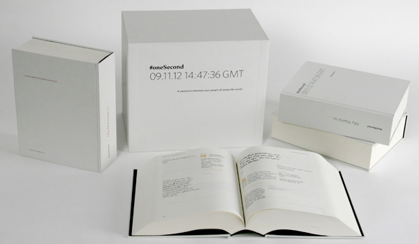
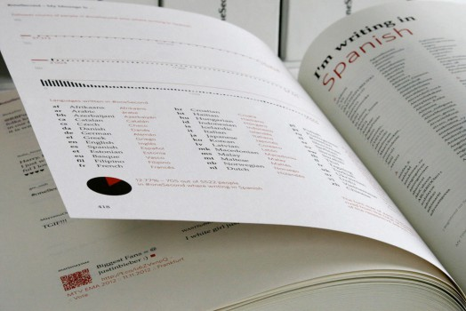
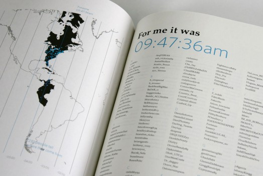
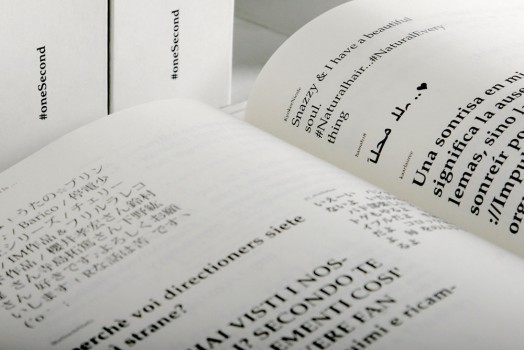
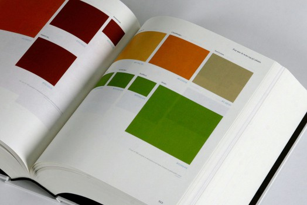

---
authors:
  - name: Philipp Adrian
    url: http://www.philippadrian.com
layout: gallery-item
title: oneSecond
description: A connection between 5522 people all across the world that have been active on Twitter within the timeframe of one second.
---

[Philipp Adrian](http://www.philippadrian.com)

A connection between 5522 people all across the world that have been active on Twitter within the timeframe of one second.

As both a catalyst and indicator of globalization, the internet can be seen as a public space, in which information disseminates in seconds. Facilitating cultural transfer and creating new local and international subcultures by overcoming geographical distances. With the help of codes and standards the internet keeps developing its own international and decentralized language. This global network, and Twitter as one of its broader intersections, is a platform for vivid interaction between most heterogeneous actors.

5522 of those actors all across the world hit the „tweet“ button at exactly the same second. By taking this moment as a frame, this connection becomes visible and by preserving it, each one of those actors emerges out of the immense volume of anonymous data and becomes an individual again.

oneSecond preserves the data of this moment on Twitter and presents it categorized and ordered in four different books. While each book highlights one single aspect of every message written and the actor behind it – providing the reader not only with an insight into that person‘s life but also reveals similarities and connections between nationalities and subcultures – all four books together provide a detailed portrait of each actor.

The project intends to shift the focus from a personalized to a more globalized view on the internet and offers the possibility to explore. Project advised by Prof. Marion Fink.

