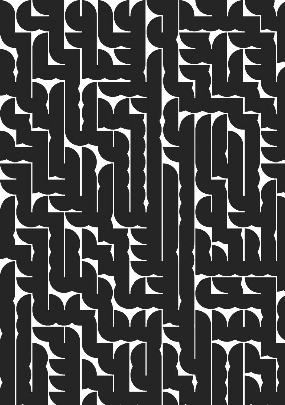
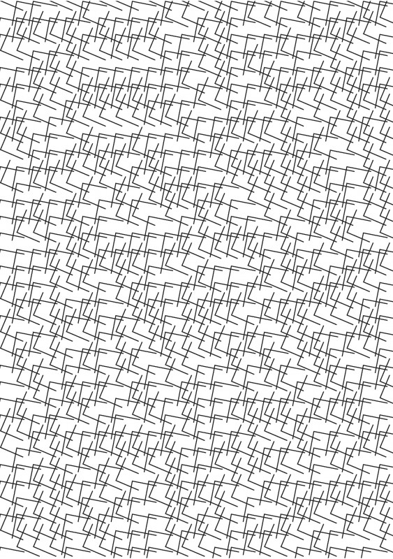
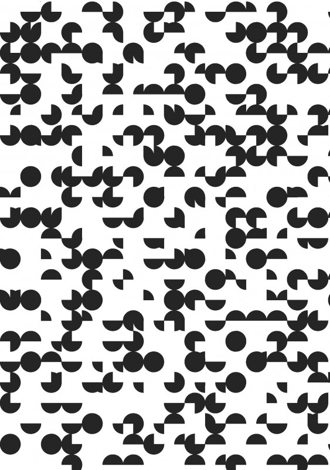

---
authors:
  - name: Boah Kim
    url: null
  - name: Leila Kuenzer
    url: null

layout: gallery-item
title: "Random Arrangement of Vectors"
description: Ornamental generators by using pre-designed Vector shapes from within Adobe InDesign and repeat them through code in a 2D matrix.
---

«Random Arrangement of Vectors» is for generating graphical patterns, which contain various kinds of vector elements within a grid system. Simply by running the code, the designated elements such as geometric shapes, organic lines, or any kinds of figures are randomly put and completed into a sheet of graphic pattern. The code can arrange the elements in ever-changing positions a number of times unlike the pattern template used in Adobe Illustrator or InDesign where designers can merely repeat putting pieces into the document to make the whole pattern. Designers, first, create the vector shapes they want to use as the elements in the pattern and put them into the layer called «Library». Then, they set up the size of grid, which is the distance between the elements and write it down in the code. By running the code, the elements are arranged randomly within the grid system on the layer called «Generated». With the function of adding pages and replicating the whole process, the code can create a varied pattern with the same elements by the number of adding pages.

