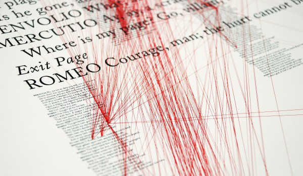
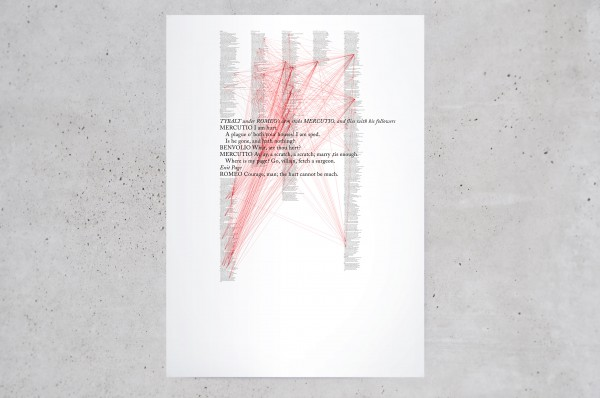
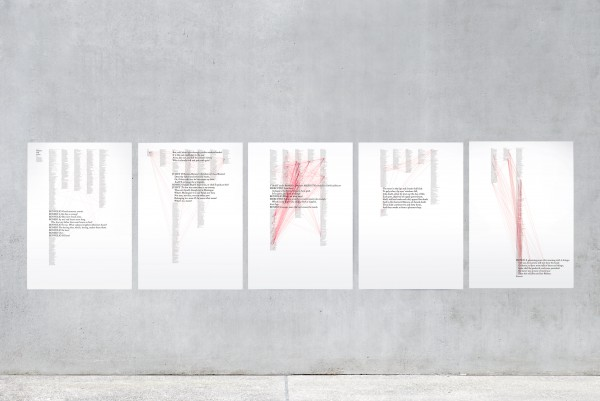
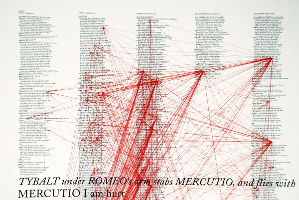
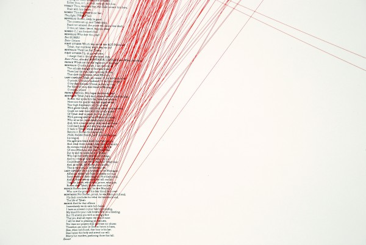

---
authors:
  - name: Patrick Baumann
    url: null
  - name: Inken Zierenberg
    url:  null
layout: gallery-item
publish: true
title: Romeo and Juliet
description: Text visualizations that highlight the narrative intensity for Shakespeare’s Romeo and Juliet by simple algorithmic rules.
featured: true

---

This project focuses on different levels of reading and the interpretation of a given text by introducing code to the creative process. The basis for this experiment is the popular play «Romeo and Juliet» by William Shakespeare. Within the dialogue, each occurrence of the words «Romeo» and «Juliet» have been connected with generated red lines. The focal point of the visualization is the close relationship between form and content. The developed page layout reflects the narrative and progress of events in the play. Each act is depicted on one poster and each of the scenes is encapsulated within one column. The developed results show a dynamic structure with a sophisticated network of lines. Because of that the beholder is able to read different, original information out of the text that was not previously visible. To give an example, the amount and configuration of the lines suggests that the name «Romeo» is spoken much more often than «Juliet». Furthermore the climax of the overall design of the drama, a typical literary structure, reveals itself by hanging the posters in a series. On a poetic level, the lines can be seen on one hand as an attachment between the two lovers and on the other hand as traces of blood through the play. The poster series can be seen objectively as an information graphic as well as an illustration.

