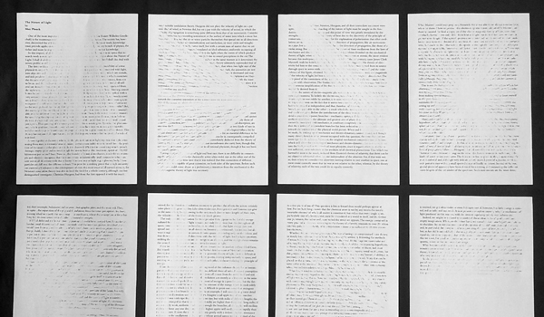
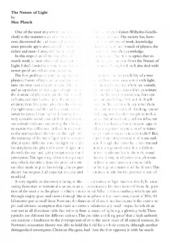
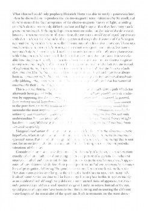
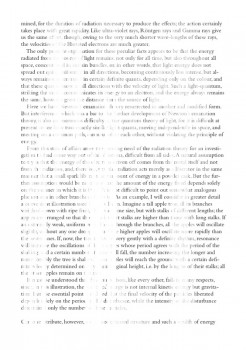

---
authors:
  - name: Jang Seop Lee
    url: null
  - name: Travis Purrington
    url: null

layout: gallery-item
publish: true
title: "The Light"
description: The project visually emphasizes the role of scripting by comparing it with natural light situation. By applying either light or scripting on a page, it simply creates new images on the page and can be completely converted into something new.

---

The project visually emphasizes the role of scripting by comparing it with natural light situations. By applying either light or scripting on a page, it simply creates new images on the page and can be completely converted into something new.

The project inspiration is from the natural light within our daily life experience. When you read a book during the day under the sunlight, the natural light creates various images on the spread with light and shadow. You also might have an experience that playing with shadows in your childhood. Then, with a simple movement or changing positions, you can intentionally project different images on the surface. Just like these experiments, you can convert a image or a text into a completely new image by applying a simple scripting.

### Source

  
[Download Source](./downloads/The_Light.zip)


    // This is generating one of the shown pages. Download the zip to view all of them.

#includepath "~/Documents/;%USERPROFILE%Documents";
#include "basiljs/bundle/basil.js";

function draw() {

    b.doc();
    b.println( b.width+" x "+b.height);

    for (var i = 0; i < 50; i++) {
        var x = b.random(180, 230);
        var y = b.random(280, 480);
        b.stroke(255,255,255);
        b.strokeWeight(b.random(1,7)); 
        var theLine1 = b.line(x,-100, x, y);
        theLine1.transparencySettings.blendingSettings.opacity=(b.random(1,80));
    }

    for (var i = 0; i < 400; i++) {
        var x = b.random(0, 405);
        var y = b.random(280, 580);
        b.stroke(255,255,255);
        b.strokeWeight(b.random(1,3)); 
        var theLine2 = b.line(205,-100, x, y);
        theLine2.transparencySettings.blendingSettings.opacity=(b.random(1,80));
    }
}

b.go();

