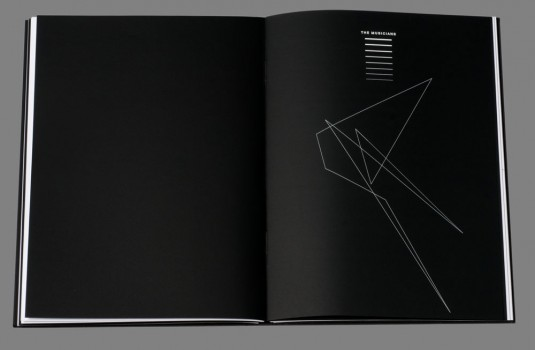

---
authors:
  - name: Gaelle Renaudin
    url: null
layout: gallery-item
title: The  Martian  Chronicles
description: Reedition of the science fiction classic book “The Martian Chronicles”, written by Ray Bradbury in 1950.
featured: true

---

The idea of the project was to write some scripts for inDesign in the most experimental way possible, and to use parameter like random as a part of the process and to integrate this to a project of editorial design.

First of all, the scripts have various uses in the book: they can simplify some processes long or difficult to realize by hand like the flush texts that all have been generated with a script. They can also give an indication of the tension and the ambiance of the chapter to come: at every beginning of a text, a script generates a form who has so many angles as there is exclamation marks in the text.

Then, to emphasis the ideas of the book, it is printed in write on a black paper when the plot takes place on Mars and in black on white when on earth, to reinforce the trip between the two planets and the relevant differences between them. BA Thesis project, HGK 2012

