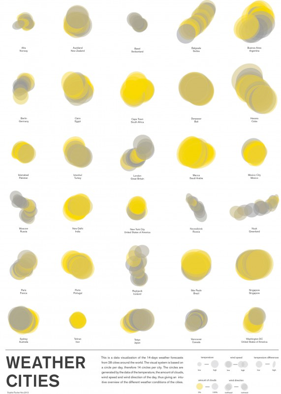

---
authors:
  - name: Sophie Fischer
    url: null
layout: gallery-item
title: Weather Cities
description: This is a data visualization of the 14-days weather forecasts from 28 cities around the world.

---

The visual system is based on a circle per day, therefore 14 circles per city. The circles are generated by the data of the temperature, the amount of clouds, wind speed and wind direction of the day, thus giving an intuitive overview of the different weather conditions of the cities.