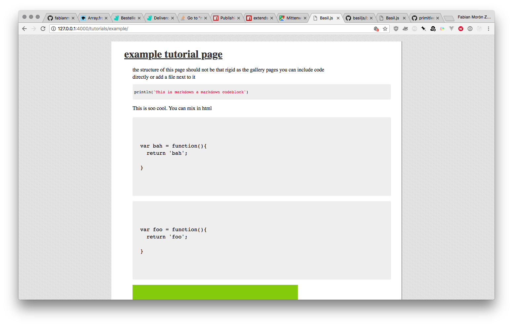

the structure of this page should not be that rigid as the gallery pages
you can include code directly or add a file next to it

```js
println('This is markdown a markdown codeblock')
```

This is soo cool. You can mix in html

<!-- and have jekyll code in that -->
<pre>
  <code class="lang">

  </code>
</pre>


<pre>
  <code>

  </code>
</pre>


<!-- Or embed gists -->
<script src="https://gist.github.com/fabianmoronzirfas/d5966159e6c9b85699d1fb26c9bb9428.js"></script>

<!-- all of this might look like this -->

