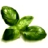

When adding images to your document, one of the most important factors is where does the image sit relative to your document. Here are a few techniques for importing and manipulating images.

## 1. Importing images with system path
While it is best practice to keep resources for InDesign close to the actual document, sometimes you may want to keep a pool of images in one location that multiple documents can reach. 

Before we begin, download the following image and save it into your ~/Pictures/ folder: 


Now we can import this image using the following code (on OS X):

```
// @includepath "~/Documents/;%USERPROFILE%Documents";
// @include "basiljs/basil.js";

function draw() {
  var imgPath = new File('~/Pictures/image-example.jpg');
  image(imgPath, 0, 0); // only set position
  image(imgPath, 200, 0, 200, 200); // also set size
}
```

***

## 2. Importing images with a relative path
Once we have saved our InDesign file, we can use clean relative paths to find images located near our document. Begin by creating a new document and save it within it's own folder somewhere on your computer. Create a new script with the following code and run it once:

```
// @includepath "~/Documents/;%USERPROFILE%Documents";
// @include "basiljs/basil.js";

function draw() {
  image('image-example.jpg', 0, 0);
}
```

You probably got a nice error warning that said 'undefined' – that is because it wasn't able to find the image, however, look in the folder where you saved your document. You will now see a new folder called 'data' (in the spirit of Processing). Copy our 'image-example.jpg' file into that folder and run the script again. Presto! 

***

## 3. Importing images from the internet
Take a journey to our tutorial on this subject: [Getting Images from URLs](http://basiljs.ch/tutorials/getting-images-from-urls/)

***

## 4. Reposition and resizing images
While the first example showed that the image() function can be used to set a size when first creating the image, we can easily change these attributes after the fact using the [`transform()`](http://basiljs.ch/dev/reference/#transform) function:

```
// @includepath "~/Documents/;%USERPROFILE%Documents";
// @include "basiljs/basil.js";

function draw() {
  image('image-example.jpg', 0, 0);

  var img = image('image-example.jpg', 0, 0);

  var imgBounds = bounds(img); // get the bounds of the image
  transform(img, "position", [36, 36]);
  transform(img, "size", [imgBounds.width*5, imgBounds.height*5]);
}
```

Note that we are now using a variable before generating our second image, thus allowing us to refer to it later. Using the [`bounds()`](http://basiljs.ch/dev/reference/#bounds) function, which outputs both the x, y position and w, h of an object, we can scale the object proportionally by modifying it's existing value. In this case, increasing it by 500%.

***

## 5. Set image blending modes
The minute you start playing with multiple images and type, blending modes such as 'multiply' will quickly be needed. Here we can change both the blendMode and opacity once we have generated our image by adding the following code beneath it:

```
 blendMode(img, MULTIPLY);
 opacity(img, 50); // from 0 - 100
</pre>

Here is a long list of additional blendMode settings to used,

- NORMAL
- MULTIPLY
- SCREEN
- OVERLAY
- SOFT_LIGHT
- HARD_LIGHT
- COLOR_DODGE
- COLOR_BURN
- DARKEN
- LIGHTEN
- DIFFERENCE
- EXCLUSION
- HUE
- SATURATION
- COLOR
- LUMINOSITY

***

## Exercise - Photocollage
Gather any number of images on your computer, throw them into your 'data' folder and build a composition of various size, position, opacity, and most definitely blending mode. 
Beyond importing images, try importing your image with a loop and have some of the magic take place automatically for you each time it brings another copy onto the canvas.

***

## 6. Set orientation point for images
By default the image coordinates are being referenced from the upper left corner. This is very helpful when adjusting the size of the image and knowing where it will go, but often it can be more useful to change that reference point to the center if aligning with other objects.

```
// @includepath "~/Documents/;%USERPROFILE%Documents";
// @include "basiljs/basil.js";

function draw() {
  // default is CORNER, image should be placed at top left corner
  imageMode(CORNER);
  var img = image("image-example.jpg", 0, 0);

  // set to CENTER, image should be just below 1st image
  imageMode(CENTER);
  var imgCenter = image("image-example.jpg", width/2, height/2);
  
}
```

***

## Bonus - Replace type with images
Here is the code from the last example in our basil.js video teaser. It finds all b's within a body of text and replaces them with that lovely leaf. 

```
// @includepath "~/Documents/;%USERPROFILE%Documents";
// @include "basiljs/basil.js";

var fontSize = 18;
var myText = "How to make PestonnIngredientsnn3 cups fresh basil leavesn1/2 cup toasted pine nutsn1/2 cup pecorino romano cheese (grated)n1/2 cup parmesan cheese (grated)n3 cloves fresh garlicn2/3 cup olive oil (or more)nnnThe pesto is fantastic in pasta dishes. For a great appetizer or snack add two tablespoons to 1.5 cups of hummus mix well and serve with vegetables and pita bread.nIf you are hardcore you can throw on a toga and make this with a huge mortar and pestle. Personally, I use a blender. (And I'm sure a food processor would be even more convenient.)nToast the pine nuts lightly in a 350F/177C oven. Let cool.nChop up the basil (if the leaves are large) and push all the basil to the bottom of the blender. Add olive oil and pulse blend with the basil. Use a chopstick or spatula to keep scraping the sides down and compressing all the ingredients.nAdd the garlic cloves, more oil, pulse and scrape.nThen add the pine nuts, more oil, keep blending and scraping.nAdd all the cheese, and add the rest of the oil (or extra oil).nBlend well until all the ingredients are homogenized. I enjoy a pesto paste, which requires less oil, but if you prefer more of a sauce texture, you can add as much oil as necessary. The pesto should be a bright green. As it oxidizes, it will turn a darker shade of green.nStore in an air-tight 16 fl oz/474 ml jar. Will keep for up to a month. (I've never tried freezing it, but if anyone does so successfully, let me know.)nn http://www.opensourcefood.com/people/chunlei/recipes/pestonThis work is licensed under a Creative Commons Attribution-Share Alike 3.0 License";

function draw() {
  textSize(fontSize);

  var tempFrame = text(myText, 0, 0, width, height);     
  var imgPath = new File('~/Pictures/image-example.jpg'); // path to image
  
  // search for all those b's!
  characters(tempFrame, function(ch){
    if(ch.contents == 'b'){
      var chbounds = bounds(ch);
        myImg = image(imgPath, chbounds.left, chbounds.top, chbounds.height, chbounds.height);
        myImg.strokeWeight = 0;
        blendMode(myImg, MULTIPLY);
        ch.contents = '   ';
      }
    });
}
```

