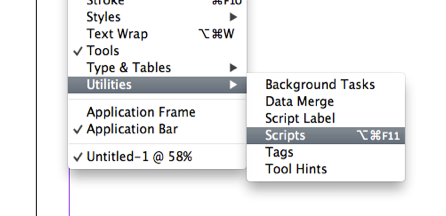
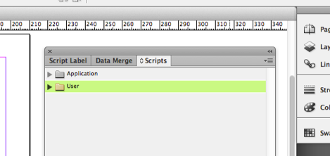
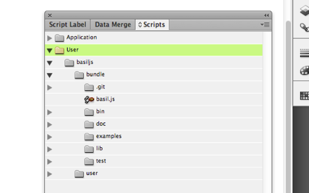

## Installation

Although basil.js scripts can simply be opened and run from ExtendScript Toolkit through the Finder / Explorer, you may wish to have access to our examples and your scripts within the Scripts window of InDesign.  

1. Get the latest copy of basil.js from our [Downloads](http://basiljs.ch/downloads) section. 

2. Use Finder (resp. Explorer) and create a folder called "basiljs" in the Documents folder of your home directory. This will be the central place where you store all basil related files. Please make sure that this folder matches *USER_FOLDER*/Documents/basiljs exactly. Note that the Documents folder might have a different name depending on your language setting and operating system, but that's ok.

3. Place the bundle folder of the zip inside the new basiljs folder.

4. Create a folder called "user" next to the bundle folder. Use this new folder for your projects and experiments. The separation of basil.js' internal and the user's files will make it easy for you to update to new versions by just overwriting the bundle.

5. Open up InDesign and activate the Scripts panel from the menu. This should look like this:

  

  

6. Right-click the "User" folder and click on "Reveal in Finder" resp. "Reveal in Explorer". 

7. Create a Symbolic Link between your basiljs folder and the Scripts Panel folder by entering the following command in Terminal (/Applications/Utilities/):
`ln -s basiljs_PATH Scripts_Panel_PATH`
This can also be done by first entering `ln -s ` add a space, drag + drop your basiljs folder over the Terminal window, make sure there is another space and drag+drop the Scripts Panel folder. You'll see what looks like a normal alias, but is now recognized in InDesign CC 10+

8. Check if InDesign has detected your basiljs folder:

  

9. Run one of the scripts in example/color to check if basil.js is installed correctly. Congratulations!

## Overview

Let's have a look at what is in the box. The file basil.js carries the actual library, it's a quite big file that you usually should not open unless you know what you are doing. The examples/ folder shows a number of little scripts that explain how the features of basil.js work and can be used as a good starting point. The lib/ folder is meant for external libraries that are bundled with basil.js and should not be used by users. If you want to add your own libraries you should put them into user/libraries instead. (Please note that the screenshot above shows a developer version of basil with more folders than you have received.)
